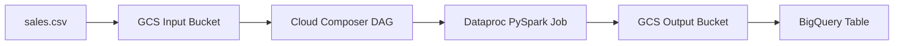

# Minimal GCP Data Engineering CI/CD Demo

This repository demonstrates a small, end-to-end CI/CD pattern for data domain projects on Google Cloud.

The deployment pipeline only publishes artifacts (DAG, Spark job, SQL, sample data). Data processing runs when the Cloud Composer DAG is triggered.

## Architecture Diagram



## Project Structure

```text
gcp-data-cicd-demo/
├── .github/workflows/deploy.yml            # Manual GitHub Actions deployment pipeline
├── composer/dags/sales_pipeline_dag.py     # Airflow DAG: Dataproc submit + BigQuery load
├── config/dev.yaml                         # DEV environment config
├── config/prod.yaml                        # PROD environment config
├── data/sales.csv                          # Small demo input data
├── dataproc/jobs/sales_transform.py        # PySpark transformation job
├── scripts/deploy_composer.py              # Optional local helper: upload DAG + runtime config
├── scripts/upload_files.py                 # Optional local helper: upload DAG/jobs/data
├── scripts/create_bigquery_dataset.py      # Optional local helper: create dataset + table
├── sql/create_dataset.sql                  # Parameterized SQL for dataset creation
├── sql/create_table.sql                    # Parameterized SQL for table creation
├── requirements.txt                        # Minimal local Python dependencies
└── README.md
```

## Pipeline Flow

1. GitHub Actions is run manually with environment input (`dev` or `prod`).
2. Workflow authenticates to GCP with GitHub OIDC + Workload Identity Federation.
3. Workflow uploads:
   - DAG files to Composer DAG bucket
   - Dataproc job files to Dataproc artifacts bucket
   - `sales.csv` to input bucket
   - selected environment config to `dags/config/runtime_config.yaml`
4. Workflow ensures BigQuery dataset and table exist.
5. You trigger the Airflow DAG in Composer.
6. DAG creates an ephemeral Dataproc cluster (single-node, low-cost).
7. DAG submits Dataproc PySpark job.
8. Job writes transformed CSV to output bucket.
9. DAG loads output into BigQuery.
10. DAG deletes the ephemeral Dataproc cluster.

## Prerequisites

- Python 3.11+
- Google Cloud CLI (`gcloud`) and BigQuery CLI (`bq`)
- GitHub repository
- Google Cloud project
- Billing enabled

## Environment Configuration

All runtime values come from:

- `config/dev.yaml`
- `config/prod.yaml`

Both files use this shape:

```yaml
environment: dev
project_id: project-7e619969-b1f6-41ff-9f2
region: us-central1
composer_bucket: gcp-demo-composer-dev
input_bucket: gcp-demo-input-dev
output_bucket: gcp-demo-output-dev
bq_dataset: sales_demo_dev
bq_table: sales_data
dataproc_job_bucket: gcp-artifacts-dev
dataproc_master_machine_type: e2-standard-2
dataproc_master_disk_size_gb: 30
dataproc_image_version: 2.2-debian12
```

Use separate bucket and dataset names for `dev` and `prod`.

Environment isolation is enforced in the DAG:

- `environment` must be exactly `dev` or `prod`.
- `composer_bucket`, `input_bucket`, `output_bucket`, and `dataproc_job_bucket` must end with `-<environment>`.
- `bq_dataset` must end with `_<environment>`.

If a `dev` config points to `prod` resources (or vice versa), the DAG fails fast before provisioning Dataproc.

## GCP Setup (Step-by-Step)

### 1) Set shell variables

```bash
export PROJECT_ID="project-7e619969-b1f6-41ff-9f2"
export PROJECT_NUMBER="$(gcloud projects describe ${PROJECT_ID} --format='value(projectNumber)')"
export LOCAL_PROJECT_NAME="gcp-demo"
export REGION="us-central1"
export REPO_OWNER="venkatesan111@gmail.com"
export REPO_NAME="gcp-demo"
export WIF_POOL_ID="github-pool"
export WIF_PROVIDER_ID="github-provider"
export DEPLOY_SA="github-deployer"
export COMPOSER_ENV_SA="composer-env-sa"
```

### 2) Enable APIs

```bash
gcloud services enable \
  composer.googleapis.com \
  dataproc.googleapis.com \
  storage.googleapis.com \
  bigquery.googleapis.com \
  iamcredentials.googleapis.com \
  sts.googleapis.com \
  cloudbuild.googleapis.com \
  container.googleapis.com \
  pubsub.googleapis.com
```

### 3) Create GCS buckets (trial-friendly, minimal)

```bash
gcloud storage buckets create gs://${LOCAL_PROJECT_NAME}-input-dev --project=${PROJECT_ID} --location=${REGION}
gcloud storage buckets create gs://${LOCAL_PROJECT_NAME}-output-dev --project=${PROJECT_ID} --location=${REGION}
gcloud storage buckets create gs://${LOCAL_PROJECT_NAME}-artifacts-dev --project=${PROJECT_ID} --location=${REGION}

gcloud storage buckets create gs://${LOCAL_PROJECT_NAME}-input-prod --project=${PROJECT_ID} --location=${REGION}
gcloud storage buckets create gs://${LOCAL_PROJECT_NAME}-output-prod --project=${PROJECT_ID} --location=${REGION}
gcloud storage buckets create gs://${LOCAL_PROJECT_NAME}-artifacts-prod --project=${PROJECT_ID} --location=${REGION}
```

### 4) Create Cloud Composer environments

Use smallest practical environment size for demo.

Create a dedicated user-managed service account for Composer environments:

```bash
gcloud iam service-accounts create ${COMPOSER_ENV_SA} \
  --project=${PROJECT_ID} \
  --display-name="Composer Environment Runtime SA"

gcloud projects add-iam-policy-binding ${PROJECT_ID} \
  --member="serviceAccount:${COMPOSER_ENV_SA}@${PROJECT_ID}.iam.gserviceaccount.com" \
  --role="roles/composer.worker"
```

```bash
gcloud composer environments create composer-dev \
  --location=${REGION} \
  --project=${PROJECT_ID} \
  --service-account=${COMPOSER_ENV_SA}@${PROJECT_ID}.iam.gserviceaccount.com \
  --image-version=composer-2-airflow-2.10.5 \
  --environment-size=ENVIRONMENT_SIZE_SMALL

gcloud composer environments create composer-prod \
  --location=${REGION} \
  --project=${PROJECT_ID} \
  --service-account=${COMPOSER_ENV_SA}@${PROJECT_ID}.iam.gserviceaccount.com \
  --image-version=composer-2-airflow-2.10.5 \
  --environment-size=ENVIRONMENT_SIZE_SMALL
```

Get each Composer DAG bucket and copy into `config/dev.yaml` and `config/prod.yaml`:

```bash
gcloud composer environments describe composer-dev \
  --location=${REGION} --project=${PROJECT_ID} \
  --format='value(config.dagGcsPrefix)'

gcloud composer environments describe composer-prod \
  --location=${REGION} --project=${PROJECT_ID} \
  --format='value(config.dagGcsPrefix)'
```

The command returns `gs://.../dags`. Set `composer_bucket` to that bucket name only.

### 5) Create Workload Identity Federation for GitHub OIDC

Create pool:

```bash
gcloud iam workload-identity-pools create ${WIF_POOL_ID} \
  --project=${PROJECT_ID} \
  --location=global \
  --display-name="GitHub Actions Pool"
```

Create provider:

```bash
gcloud iam workload-identity-pools providers create-oidc github-provider \
  --project=$PROJECT_ID \
  --location=global \
  --workload-identity-pool=github-pool \
  --issuer-uri="https://token.actions.githubusercontent.com" \
  --attribute-mapping="google.subject=assertion.sub,attribute.repository=assertion.repository,attribute.actor=assertion.actor" \
  --attribute-condition="assertion.repository=='venkatesansg111/gcp-demo' && assertion.ref=='refs/heads/main'"
```

Create deploy service account:

```bash
gcloud iam service-accounts create ${DEPLOY_SA} \
  --project=${PROJECT_ID} \
  --display-name="GitHub CI Deployer"
```

Allow GitHub repo to impersonate service account:

```bash
gcloud iam service-accounts add-iam-policy-binding \
  ${DEPLOY_SA}@${PROJECT_ID}.iam.gserviceaccount.com \
  --project=${PROJECT_ID} \
  --role="roles/iam.workloadIdentityUser" \
  --member="principalSet://iam.googleapis.com/projects/${PROJECT_NUMBER}/locations/global/workloadIdentityPools/${WIF_POOL_ID}/attribute.repository/${REPO_OWNER}/${REPO_NAME}"
```

Grant minimal deployment roles to deploy service account:

```bash
gcloud projects add-iam-policy-binding ${PROJECT_ID} \
  --member="serviceAccount:${DEPLOY_SA}@${PROJECT_ID}.iam.gserviceaccount.com" \
  --role="roles/storage.objectAdmin"

gcloud projects add-iam-policy-binding ${PROJECT_ID} \
  --member="serviceAccount:${DEPLOY_SA}@${PROJECT_ID}.iam.gserviceaccount.com" \
  --role="roles/bigquery.dataEditor"

gcloud projects add-iam-policy-binding ${PROJECT_ID} \
  --member="serviceAccount:${DEPLOY_SA}@${PROJECT_ID}.iam.gserviceaccount.com" \
  --role="roles/bigquery.jobUser"
```

Get provider resource name for GitHub variable:

```bash
gcloud iam workload-identity-pools providers describe ${WIF_PROVIDER_ID} \
  --project=${PROJECT_ID} \
  --location=global \
  --workload-identity-pool=${WIF_POOL_ID} \
  --format='value(name)'
```

### 6) Ensure Composer runtime identity can run the DAG actions

Grant roles to the Composer environment service account (from Composer environment details):

- `roles/dataproc.editor`
- `roles/storage.objectViewer`
- `roles/storage.objectAdmin` (for output bucket)
- `roles/bigquery.dataEditor`
- `roles/bigquery.jobUser`

## Required GCP Resources

Create these resources manually:

- GCP project
- Cloud Composer environment (`composer-dev`, `composer-prod`)
- GCS buckets:
  - input bucket(s)
  - output bucket(s)
  - Dataproc job artifacts bucket(s)
  - Composer DAG bucket(s) from Composer environment
- BigQuery dataset(s)
- Service account for GitHub deployment
- Workload Identity Pool
- Workload Identity Provider
- IAM policy bindings and roles

## GitHub Configuration

### Repository Variables

Set these in GitHub repository settings.

| Variable | Value |
|---|---|
| `GCP_PROJECT_ID` | Your GCP project ID |
| `GCP_REGION` | Region (for example `us-central1`) |
| `WORKLOAD_IDENTITY_PROVIDER` | Full provider resource name from gcloud describe |
| `SERVICE_ACCOUNT` | `github-deployer@<project>.iam.gserviceaccount.com` |

### Repository Secrets

No secrets are required for this demo if you use OIDC + Workload Identity Federation only.

### Environment Variables vs Secrets (Best Practice)

- Repository Variables: shared non-sensitive values used across all environments.
- Repository Secrets: shared sensitive values (not needed in this demo).
- Environment Variables (`dev`, `prod`): non-sensitive values that differ per environment.
- Environment Secrets (`dev`, `prod`): sensitive values that differ per environment.

Recommended here:

- Keep `WORKLOAD_IDENTITY_PROVIDER` and `SERVICE_ACCOUNT` as repository variables.
- Keep all deploy target details in `config/dev.yaml` and `config/prod.yaml`.
- Use environment secrets only when truly needed (for example API keys for downstream systems).

## Deploy

1. Push repository to GitHub.
2. Open Actions tab.
3. Select workflow: Deploy GCP Data CI/CD Demo.
4. Click Run workflow.
5. Choose `dev` or `prod`.
6. Run.

This deploys artifacts only. It does not automatically execute data processing.

## Verify

1. Open Composer UI.
2. Find DAG `sales_pipeline_dag`.
3. Trigger DAG manually.
4. Verify output file exists under:
   - `gs://<output_bucket>/processed_sales.csv/`
5. Verify BigQuery table contains transformed rows:

```bash
bq query --use_legacy_sql=false \
  "SELECT * FROM `<project_id>.<dataset>.sales_data` ORDER BY order_id"
```

Expected additional column:

- `total_amount = quantity * price`

## Cleanup

```bash
# Composer environments
gcloud composer environments delete composer-dev --location=${REGION} --project=${PROJECT_ID} --quiet
gcloud composer environments delete composer-prod --location=${REGION} --project=${PROJECT_ID} --quiet

# Buckets
gcloud storage rm --recursive gs://${LOCAL_PROJECT_NAME}-input-dev
gcloud storage rm --recursive gs://${LOCAL_PROJECT_NAME}-output-dev
gcloud storage rm --recursive gs://${LOCAL_PROJECT_NAME}-artifacts-dev
gcloud storage rm --recursive gs://${LOCAL_PROJECT_NAME}-input-prod
gcloud storage rm --recursive gs://${LOCAL_PROJECT_NAME}-output-prod
gcloud storage rm --recursive gs://${LOCAL_PROJECT_NAME}-artifacts-prod

# BigQuery datasets
bq rm -r -f -d ${PROJECT_ID}:sales_demo_dev
bq rm -r -f -d ${PROJECT_ID}:sales_demo_prod

# Service account
gcloud iam service-accounts delete ${DEPLOY_SA}@${PROJECT_ID}.iam.gserviceaccount.com --project=${PROJECT_ID} --quiet
gcloud iam service-accounts delete ${COMPOSER_ENV_SA}@${PROJECT_ID}.iam.gserviceaccount.com --project=${PROJECT_ID} --quiet

# Workload Identity provider and pool
gcloud iam workload-identity-pools providers delete ${WIF_PROVIDER_ID} \
  --project=${PROJECT_ID} --location=global --workload-identity-pool=${WIF_POOL_ID} --quiet

gcloud iam workload-identity-pools delete ${WIF_POOL_ID} \
  --project=${PROJECT_ID} --location=global --quiet
```

## Notes

- This project intentionally avoids Terraform/IaC to keep CI/CD concepts simple.
- Composer and Dataproc can incur cost quickly. Delete resources when not in use.
- Dataproc clusters are ephemeral and are created/deleted by the DAG per run.
- Dataproc writes CSV output as a folder (`processed_sales.csv/`) with part files.
